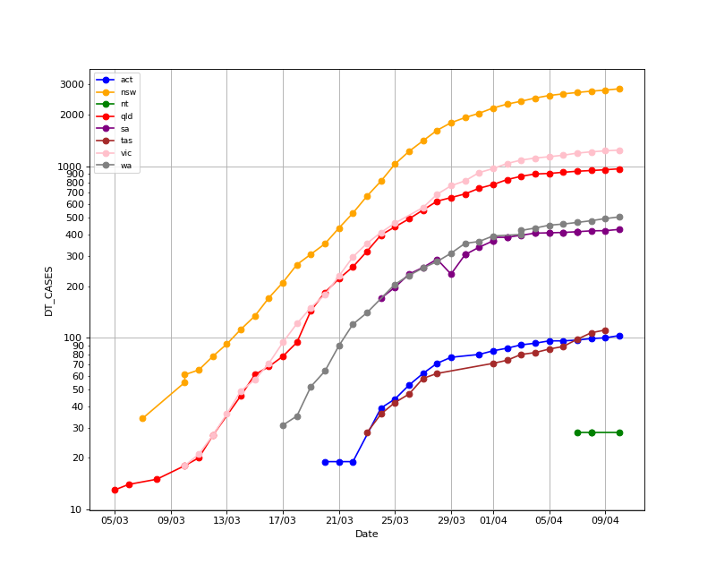
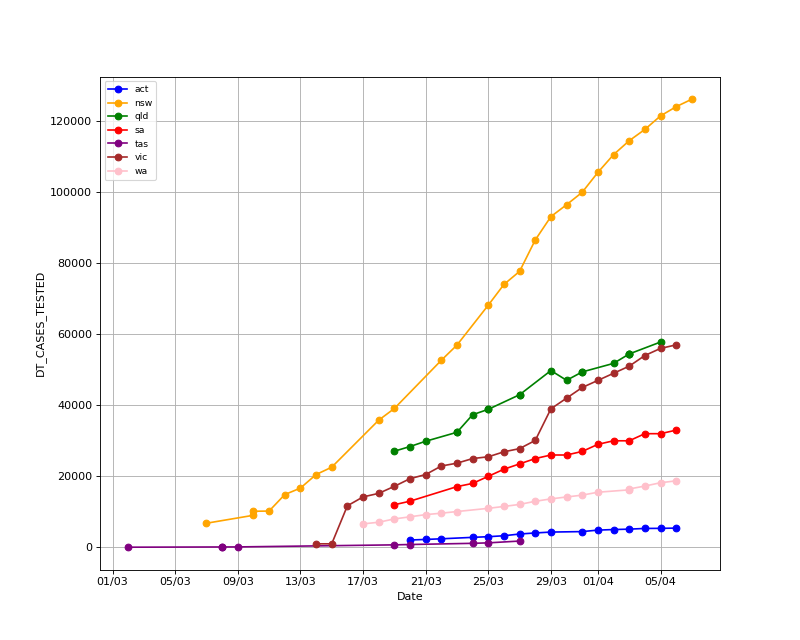
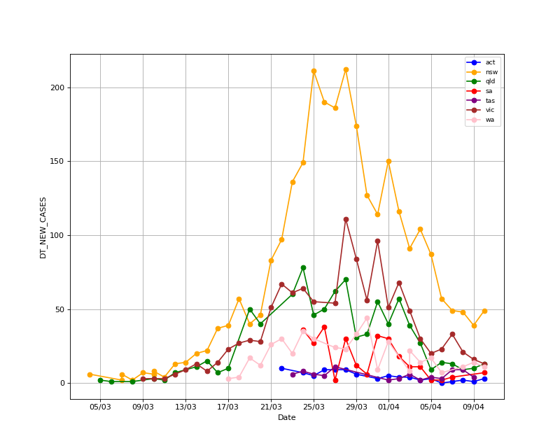
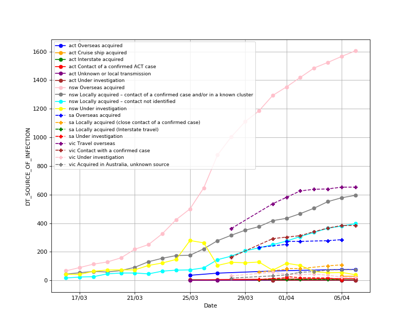

# Introduction

This repo contains a collection of scrapers for COVID-19 data.
Things are changing fast as of writing this, so they may or 
may not be functional.

* hospitals/get_hospitals.py gets COVID-19 hospital/clinic information 
  from the state websites. As of 29 March the WA data needs to be updated 
  to a different URL.
  
* vic_power_bi_grabber/grab.py gets Victorian regional statistics etc
  from https://app.powerbi.com/view?r=eyJrIjoiODBmMmE3NWQtZWNlNC00OWRkLTk1NjYtMjM2YTY1MjI2NzdjIiwidCI6ImMwZTA2MDFmLTBmYWMtNDQ5Yy05Yzg4LWExMDRjNGViOWYyOCJ9
  
* state_news_releases/ will get various statistics from state government 
  news releases. It currently only gives time series data for the number 
  of tests performed for each state and territory 
  (except for the NT, which doesn't provide data).
  It will be expanded soon. 

# Graphs

These graphs were created using automatically crawled data, and there are probably errors.

Please do **not** use these for any important decision-making purposes!

## Australia-Wide

Number positive cases:

Number tests (including positives):

Number new cases:

Source of infection:

## NSW

Age breakdown for female and male respectively:

.png)

.png)

Cases by region:

.png)

## QLD

Cases by region:

.png)

## WA

Cases by region:

.png)

## Victoria

Victoria only includes a small number of samples at this stage.

Age breakdown for female and male respectively:

.png)

.png)

Cases by region

%20(a-l).png)

%20(m-z).png)

